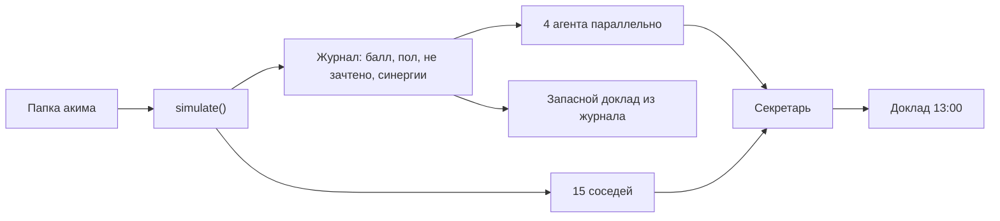

# Аким на 5 часов — план реализации

Рабочее название папки: `akim-na-5-chasov` в `C:\Users\admin\Desktop\Work`.

Это план сборки, а не сама сборка. Ниже зафиксированы продукт, правила города, архитектура, порядок работ и промпты, которыми проект можно отдать кодящему агенту по частям.

## 1. Что именно строим

Симулятор одного рабочего дня акима. В 08:00 у всех команд одна и та же папка: шесть условных районов, одни и те же показатели, бюджет **1 000** условных единиц. До 13:00 команда принимает **ровно пять решений** — по одному пакету в каждом направлении:

1. Транспорт
2. Озеленение
3. Социальная инфраструктура
4. Безопасность
5. Городской сервис

В 13:00 город отвечает числом **Astana Quality of Life Score** и докладом: где стало лучше, кто остался за бортом, что город не засчитал и какой соседний ход дал бы другой балл.

Образ интерфейса — не тёмная админка, а **папка акима**: тёплая бумага, чернила, золото печати, схема города вместо GIS. Часы в углу сдвигаются с каждым зафиксированным решением: 08:00 → 12:00, в 13:00 день запечатан.

Фраза, вокруг которой собран весь продукт:

> Средний город почти не отличает два сценария. Балл отличает, потому что четверть оценки — это самый слабый район.

Данные синтетические. Районы — архетипы, похожие на знакомую структуру города (левый берег, старый правый, растущий край, река), и в интерфейсе прямо написано: «условные районы, не официальная статистика». Персональных данных нет.

## 2. Как это закрывает критерии

| Критерий | Баллы | Где это живёт в продукте |
| --- | --- | --- |
| Соответствие задаче и работоспособность | 25 | Пять решений, общий бюджет 1000, жёсткий отказ при превышении, балл, объяснение |
| Техническая реализация и AI | 25 | Общий движок на клиенте и сервере, совет из 4 агентов + секретарь с инструментом только на чтение журнала, рекомендации пересчитываются движком |
| README и воспроизводимость | 25 | Один `npm install` и `npm run dev`. `npm test` и `npm run demo` доказывают смену балла без браузера и без API-ключа |
| Ценность | 15 | Видимый компромисс: центр, периферия, зимний запас. Формула открыта на странице «Как считается» |
| Потенциал и оригинальность | 10 | Пол города, зимняя скидка, «не зачтено», ледяной дождь в 17:40, тень другого решения |

Обязательное правило продукта: **балл считает только движок**. Модель получает уже посчитанный журнал и не имеет права вводить новые числа. Иначе жюри меняет решения, балл «плывёт», и критерий «другой набор — другой балл» разваливается на демонстрации.

## 3. День акима

Один экран-мастер, пять часов, потом доклад.

| Время | Направление | Вопрос часа |
| --- | --- | --- |
| 08:00 | Транспорт | Кому достанется утро без ожидания? |
| 09:00 | Озеленение | Где ветер и пыль сильнее генплана? |
| 10:00 | Социальная инфраструктура | Какой двор получит школу, а какой — запись в приложении? |
| 11:00 | Безопасность | Свет во дворе или камера на магистрали? |
| 12:00 | Городской сервис | Кто приедет, когда город встанет? |
| 13:00 | Доклад | Балл, карта, сильные стороны, риски, последствия, тень другого решения |
| 17:40 | Нештатная ситуация, если успеете | Ледяной дождь. Запас бюджета либо гасит удар, либо нет |

На каждом часе четыре карточки-стратегии. Выбирается ровно одна. Смена раннего часа сразу пересчитывает бюджет и живой балл. Карточка, которая не влезает в остаток, получает печать **«не входит в бюджет»** и не нажимается. Проверка повторяется на сервере в `POST /api/analyze`. Обойти её через интерфейс нельзя: сервер отвечает 400 и не зовёт модель.

Живой балл на клиенте и итоговый балл на сервере — это одна функция `simulate()`. Расхождение считается дефектом.

Команда вводит имя в начале. Прогон сохраняется локально и может встать рядом с другими прогонами на этой машине. Отдельных аккаунтов нет.

## 4. Правила города

### 4.1. Балл

Пять показателей района, каждый от 0 до 100, **чем выше, тем лучше**:

- mobility — удобство движения
- green — обеспеченность зеленью и ветрозащитой
- social — социальная инфраструктура
- safety — ощущаемая безопасность
- service — качество городских сервисов

Веса района:

```
districtScore =
  0.20 * mobility +
  0.15 * green +
  0.25 * social +
  0.20 * safety +
  0.20 * service
```

Социальный вес самый тяжёлый: в брифе это отдельный дефицит, и именно он открывает или закрывает эффект камер.

Дальше город, не среднее ради среднего:

```
cityMean = сумма (populationWeight * districtScore)
floor    = минимальный districtScore среди шести районов
AQoLS    = 0.75 * cityMean + 0.25 * floor
```

На экране балл с одним знаком после запятой. Рядом всегда два меньших числа: **средний** и **пол** (самый слабый район). В этом зазор и есть сюжет.

Утренний ориентир при данных из раздела 5: средний около **52.9**, пол Нұры около **38.6**, AQoLS около **49.3**.

### 4.2. Как применяются пакеты

Вклад каждого пакета хранится отдельно: источник, район, показатель, величина, теги. Внутри одного пакета точечный эффект по району заменяет эффект «на весь город» по тому же показателю, а не складывается с ним. Эффекты разных пакетов складываются.

Порядок, его нельзя менять местами:

1. Собрать сырые вклады.
2. **Зима.** У пакетов с тегом `winter_fragile` положительные вклады умножаются на **0.70**. Если среди пяти решений есть `winter_ops`, множитель этого пакета становится **0.85**. Списанная часть пишется в журнал как скидка.
3. **Доверие.** У пакетов с тегом `cameras` в районе, где социальный показатель после всех социальных вкладов **ниже 50**, вклад в безопасность умножается на **0.6**. Разница пишется как **«не зачтено»**.
4. **Доступ.** Если по району суммарный прирост mobility ≥ 4 и social ≥ 8, к social добавляется ещё 15% уже собранного социального прироста. Люди доезжают до новой школы.
5. **Свет и листва.** Если прирост green ≥ 3 и вклад в safety от пакетов с тегом `lighting` ≥ 4, safety +1.
6. **Две стройки.** Если район помечен как `heavy` у двух или больше выбранных пакетов, service −2. Улица перекопана дважды.
7. Обрезать каждый показатель в диапазон 0…100.
8. Посчитать средний, пол и AQoLS. Посчитать утренний балл тем же кодом на пустом наборе и отдать дельту.

Неизрасходованный остаток **не повышает** AQoLS. Он копится как резерв и работает только в часе 17:40. Иначе оптимальная стратегия — ничего не делать.

### 4.3. Два канонических сценария

Оба влезают в бюджет. Оба должны жить в тестах как фикстуры.

**Центр, 940.** `center_ring` + `esil_boulevard` + `digital_queue` + `cameras_blanket` + `front_office_esil`

Есиль становится витриной. Нұра почти не двигается. Часть камер в Нұре и на Сарайшыке не зачитывается: социальной ткани ниже 50. На Есиле две стройки, сервис теряет 2 пункта. Ориентир ручного просчёта: средний около **56.1**, пол около **40.8**, AQoLS около **52.3**.

**Периферия, 970.** `nura_last_mile` + `yard_trees` + `nura_schools` + `lighting_edge` + `mobile_crews`

Нұра получает автобус, школу, свет и бригады. Срабатывают доступ и «свет и листва». Камер нет, списывать нечего. Ориентир: средний около **56.7**, пол около **52.1**, AQoLS около **55.5**.

Сюжет для жюри: средние почти рядом, балл расходится больше чем на 2 пункта из-за пола. Если реализация даёт другой зазор, чинить порядок модификаторов, а не ослаблять тест.

**Дорогие пять, 1180, обязаны быть отвергнуты:** самый дорогой пакет каждого часа (`center_ring` 260, `river_frame` 220, `nura_schools` 260, `district_posts` 240, `mobile_crews` 200).

**Дешёвые пять, 490, обязаны проходить:** `maintenance` + `yard_trees` + `digital_queue` + `prevention` + `portal`.

### 4.4. Тень другого решения

Сосед сценария — замена ровно одного из пяти пакетов на другой пакет того же часа. Таких соседей не больше 15. Движок считает их все. Наружу выходят:

- до трёх соседей с AQoLS выше текущего, по убыванию балла;
- отдельно сосед с самым высоким полом, если его нет среди этих трёх;
- если никто не лучше, фраза «среди соседних ходов этот набор сильнейший».

Модель пишет текст только к уже посчитанной карточке соседа. Она не оценивает «что было бы, если».

### 4.5. Час 17:40 — ледяной дождь

Считается вторым прогоном поверх уже запечатанного сценария, с собственным AQoLS «после дождя».

- Выбран `winter_ops`: mobility −1 по всем районам. Доклад мягкий: бригады уже в графике.
- Иначе: Нұра mobility −6, Байконур mobility −5, service −3 по всем районам.
- Если резерв ≥ 150 и команда подтверждает трату, штраф делится пополам, резерв уменьшается на 150.
- Периферийный канон (резерв 30) и центр (резерв 60) купить погоду не могут. Отдельный зимний набор `left_bank_micro` + `yard_trees` + `family_hubs` + `prevention` + `winter_ops` стоит 710 и оставляет 290 — он слабее периферии в ясный день и устойчивее в дождь.

Это опциональный слой. Его стоит делать после доклада, потому что без него продукт уже закрывает must have.

## 5. Данные

Версия данных: `astana-synthetic-v1`. Хеш версии пишется в каждый сохранённый прогон.

Население — доли, сумма 1. Показатели — целые.

| id | Район | Доля | mobility | green | social | safety | service | Характер |
| --- | --- | --- | --- | --- | --- | --- | --- | --- |
| esil | Есиль | 0.22 | 48 | 42 | 70 | 74 | 78 | Левый берег, офисы, слабая зелень, сильный сервис |
| almaty | Алматы | 0.20 | 55 | 38 | 62 | 48 | 52 | Более старый берег, дворы, просадка безопасности |
| saryarka | Сарыарка | 0.18 | 50 | 45 | 58 | 60 | 55 | Семейный район, ровный середняк |
| baikonur | Байконур | 0.12 | 44 | 36 | 54 | 58 | 50 | Плотный, зависим от автобуса |
| nura | Нұра | 0.16 | 32 | 28 | 35 | 56 | 40 | Растущий край, пыль, нет школы рядом |
| saraishyq | Сарайшық | 0.12 | 46 | 62 | 48 | 64 | 57 | Река и парки, тонкая социальная ткань |

Голоса для цитат, все вымышленные, привязаны к району и используются только если район есть среди тех, кого сценарий реально сдвинул:

- Нұра — Айгерим, 34, двое детей
- Алматы — Ерлан, 67
- Есиль — Мадина, 29
- Сарыарка — Дмитрий, 41
- Байконур — Алина, 22
- Сарайшық — Бекзат, 45

### Каталог из 20 пакетов

Поле `all` означает «каждый район, у которого нет точечной строки по этому показателю».

**Транспорт**

| id | Название | Цена | Теги | Эффект |
| --- | --- | --- | --- | --- |
| center_ring | Сарыарқалық сақина | 260 | center, heavy: esil, saryarka | esil mobility +8; saryarka +6; almaty +2 |
| nura_last_mile | Нұра: последняя миля | 230 | equity, winter_ok | nura mobility +16; baikonur +5; saryarka +2; almaty +1 |
| left_bank_micro | Микромобильность левого берега | 140 | winter_fragile | esil mobility +6, green +2; saraishyq mobility +4, green +2 |
| maintenance | Содержание без рывка | 70 | safe | all mobility +1 |

**Озеленение**

| id | Название | Цена | Теги | Эффект |
| --- | --- | --- | --- | --- |
| esil_boulevard | Бульвары Есиля | 200 | center, heavy: esil | esil green +14; saraishyq green +3 |
| nura_shelter | Зелёные экраны Нұры | 180 | equity | nura green +16, safety +2; baikonur green +3 |
| river_frame | Зелёный каркас реки | 220 | heavy: saraishyq, esil | saraishyq green +8; esil +6; almaty +4 |
| yard_trees | Деревья во дворы | 110 | equity | all green +4 |

**Социальная инфраструктура**

| id | Название | Цена | Теги | Эффект |
| --- | --- | --- | --- | --- |
| nura_schools | Школы и дворы Нұры | 260 | equity, heavy: nura | nura social +18, service +3 |
| almaty_clinics | Поликлиники Алматы | 210 | heavy: almaty | almaty social +12, safety +2 |
| family_hubs | Семейные хабы | 180 | — | saryarka social +10; baikonur +6; nura +3 |
| digital_queue | Цифровая запись | 90 | light | all social +1, service +2 |

**Безопасность**

| id | Название | Цена | Теги | Эффект |
| --- | --- | --- | --- | --- |
| cameras_blanket | Камеры на магистралях | 210 | cameras | nura safety +12; almaty +6; baikonur +4; esil +4; saryarka +3; saraishyq +2 |
| lighting_edge | Свет на окраинах | 170 | lighting, equity | nura safety +10; baikonur +6; almaty +4 |
| district_posts | Участковые точки | 240 | heavy: almaty, nura | almaty safety +9; saryarka +5; nura +5 |
| prevention | Свет во всех дворах | 120 | lighting | all safety +3 |

**Сервис**

| id | Название | Цена | Теги | Эффект |
| --- | --- | --- | --- | --- |
| front_office_esil | Фронт-офис на левом берегу | 180 | center | esil service +10; all others service +1 |
| mobile_crews | Мобильные бригады | 200 | equity | nura service +9; almaty +8; baikonur +3; esil, saryarka, saraishyq +1 |
| winter_ops | Зимнее содержание | 160 | winter_ok | all service +4, mobility +1; меняет зимний множитель хрупких мер на 0.85 |
| portal | Единое окно заявок | 100 | light | all service +3 |

Короткие подписи для карточек, их надо положить в данные, а не выдумывать в вёрстке:

- center_ring — «Быстрее там, где и так есть работа»
- nura_last_mile — «Тёплая остановка на краю»
- left_bank_micro — «Летом отлично. В январе под вопросом»
- maintenance — «Дыры закроем, ритм города тот же»
- esil_boulevard — «Витрина, которую видно из офиса»
- nura_shelter — «Полоса деревьев против ветра и пыли»
- river_frame — «Связать берега зеленью»
- yard_trees — «Понемногу каждому двору»
- nura_schools — «Школа, до которой можно дойти»
- almaty_clinics — «Врач на старом берегу»
- family_hubs — «Кружки и кабинет рядом с домом»
- digital_queue — «Талон в телефоне, здание прежнее»
- cameras_blanket — «Объектив не заменяет двор»
- lighting_edge — «Дорога от остановки до подъезда»
- district_posts — «Люди, а не только стойка»
- prevention — «Фонарь в каждом дворе, без рывка»
- front_office_esil — «Сервис там, где его и так хватает»
- mobile_crews — «Бригада едет к заявке, а не наоборот»
- winter_ops — «Техника, которая уже заведена в октябре»
- portal — «Одна форма вместо пяти кабинетов»

## 6. Архитектура

Один репозиторий, один процесс. Так выше шанс, что жюри повторит запуск с README.

```
akim-na-5-chasov/
  README.md
  package.json
  .env.example
  .gitignore
  data/city.json              # районы, пакеты, событие, веса, версия
  lib/engine/types.ts
  lib/engine/simulate.ts      # чистая функция, без сети и без Node API
  lib/engine/recommend.ts     # соседи
  lib/engine/simulate.test.ts
  lib/engine/demo.ts          # печать канонов в консоль
  lib/ai/council.ts           # параллельные агенты + секретарь
  lib/ai/fallback.ts          # доклад из журнала, если нет ключа или таймаут
  lib/ai/schemas.ts           # zod
  lib/store/runs.ts           # data/runs.json, файл в gitignore
  app/page.tsx                # утро, имя команды, старт
  app/decide/page.tsx         # пять часов
  app/report/page.tsx         # 13:00
  app/compare/page.tsx
  app/method/page.tsx         # открытая формула
  app/api/analyze/route.ts
  app/api/runs/route.ts
  app/api/shock/route.ts
  components/                  # часы, бюджет, карточка, схема, доклад
```

Стек:

- Next.js (App Router) + TypeScript + Tailwind
- Vitest для движка
- Zod на границе JSON от модели
- Движок импортируется и из клиентских компонентов, и из route handlers. В нём нет `fs`, нет `process.env`

Модель:

- Провайдер xAI, ключ `XAI_API_KEY`, база `https://api.x.ai/v1`
- Модель по живой документации на 2026-09-23: **`grok-4.7`**. Перед кодом сверить имя на https://docs.x.ai/developers/models и быстрый старт на https://docs.x.ai/developers/quickstart
- Ключ только на сервере. В браузер уходит готовый текст доклада
- Клиент: официальный SDK `openai` с `baseURL: "https://api.x.ai/v1"`. Четыре специалиста параллельно, затем секретарь. Короткий структурированный вывод
- Повторный запрос с тем же набором решений и той же версией данных берётся из памяти процесса, чтобы клики жюри не жгли токены



Сохранение прогонов — файл `data/runs.json` на машине, где крутится сервер. Для зала этого достаточно: два браузера, две команды, один ноутбук. Внешней базы нет.

## 7. Совет агентов

Каждый специалист получает один и тот же журнал `simulate()` и карточку тени. Каждый возвращает JSON по схеме, не свободное эссе. Секретарь собирает доклад. Если схема не сошлась дважды или ключа нет, на экран встаёт запасной доклад из `fallback.ts`, собранный из тех же полей журнала.

| Агент | Задача | Объём |
| --- | --- | --- |
| Урбанист | Кто вырос, кто остался полом, сошёлся ли средний с полом | 2 наблюдения |
| Экономист | Цена набора, резерв, что сосед даёт за замену одного часа | 2 наблюдения |
| Голос районов | Три реплики только от персон районов из `biggestMovers` | 3 короткие цитаты |
| Риски | Зима, стройки, не зачтённые камеры, дождь | 2 риска |
| Секретарь | Сильные стороны, риски, последствия на год, подписи к тени | связный доклад |

Секретарю доступен один инструмент: `readDistrict(districtId)`. Он возвращает срез журнала по району и больше ничего. В интерфейсе виден след: «Секретарь открыл карточку Нұры». Лимит — два вызова. Это и есть agentic-контур, который можно показать: агенты параллельно, секретарь дочитывает район, числа всё равно из движка.

Запасной доклад обязан называть балл, дельту к утру, район-пол, средний, крупнейший сдвиг и строку «не зачтено» (или «город засчитал все заявленные эффекты»). Такой текст можно зачитывать и без ключа.

Кэш и таймаут: специалисты 20 секунд, секретарь 25 секунд. По таймауту экран не крутится пустым — сразу запасной доклад и пометка, что совет не успел.

## 8. Экраны

Визуальный язык: бумага `#F3EDE2`, чернила `#1A2332`, золото `#A9782C`, степь `#1E6B52`, река `#2C5F7C`, печать отказа `#8C2F2F`. Заголовки — мягкая антиква (Fraunces или аналог, файлы шрифта в репозитории, чтобы сцена жила без Google Fonts). Текст — нейтральный гротеск. Звука нет.

**Утро.** Имя команды, бюджет 1 000, утренний балл, одна фраза про пол города, кнопка «Открыть день».

**Час.** Слева схема из шести пятен и реки. Это рисунок, не карта: подпись «схема условных районов». Цвет пятна — текущий districtScore выбранного черновика. Справа четыре карточки, остаток бюджета, живой AQoLS и дельта к утру. Наведение на карточку подсвечивает районы, которые она двигает. Низ: пять часов как закладки, уже выбранные можно переоткрыть.

**Доклад.** Крупно AQoLS и дельта. Под ним средний и пол. Схема «было / стало». Журнал города: синергии, стройки, не зачтено. Текст секретаря тремя блоками: сильные стороны, риски, последствия. Блок «Тень другого решения» с настоящей дельтой; клик по тени подставляет набор и возвращает на час, чтобы жюри увидело смену балла. Кнопки: «Сравнить команды», «Собрать доклад на печать», если готов слой события — «Наступило 17:40».

**Как считается.** Формула, веса, четыре правила модификаторов, оба канона с их баллами из живого движка, не из захардкоженного текста. Страница нужна и жюри, и README.

**Сравнение.** Столбцы команд: AQoLS, пол, резерв, пять коротких названий пакетов. Прогоны другой версии данных помечаются как несравнимые.

**Печать.** Одна страница `@media print`: команда, балл, пять решений с ценами, таблица районов, три сильные стороны, три риска. Отдельная библиотека презентаций не нужна.

Пустые и плохие состояния, которые надо показать, а не только счастливый путь:

- не все пять часов закрыты — доклада нет, виден список пустых часов;
- набор дороже 1000 — сервер 400, экран показывает печать и не вызывает модель;
- нет `XAI_API_KEY` — балл и запасной доклад на месте, на докладе тихая пометка «совет работает по журналу модели»;
- сравнение без единого прогона — пустая полка с фразой «день ещё никто не запечатал».

## 9. Что входит в сдачу, и что после

**Сдача, без этого на защиту не выходить**

- Общие данные и бюджет 1000
- Ровно одно решение на направление
- Невозможность превысить бюджет в интерфейсе и на сервере
- Живой и итоговый AQoLS из одного движка, дельта к утру
- Средний и пол на докладе
- Совет либо запасной доклад из журнала: сильные стороны, риски, последствия
- Тесты канонов и `npm run demo`
- README с запуском на Windows и сценарием демонстрации на 3 минуты

**Если остаётся время, в этом порядке**

1. Тень другого решения с пересчётом соседей
2. Подсветка «не зачтено» и синергий в журнале
3. Страница формулы
4. Сравнение команд и печатный лист
5. Час 17:40

Вне скоупа, даже если очень хочется: авторизация, реальный геослой, мобильное приложение, мультиплеер по сети, полная казахская локализация интерфейса, генерация PPTX, отдельные микросервисы. Казахский остаётся в именах районов и в заголовках часов.

## 10. Порядок сборки

1. **Движок и данные.** Пока нет зелёных тестов канонов, интерфейс не начинать. Здесь рождается сюжет «средний рядом, пол разный».
2. **Папка и пять часов.** Живой балл, печать бюджета, схема.
3. **Доклад.** Сначала запасной текст из журнала, чтобы экран 13:00 уже можно было показывать. Потом совет поверх того же JSON.
4. **Тень, сравнение, печать, дождь.** Каждый слой сам по себе выключаемый. Сломанный дождь не должен ломать доклад.
5. **README и прогон демо с чистого клона.** Последний час проекта — это воспроизводимость, у неё те же 25 баллов, что у технической реализации.

Проверка руками перед защитой:

- центр и периферия дают разные баллы, периферия выше хотя бы на 2;
- пять дорогих пакетов не анализируются;
- замена одного пакета в периферии меняет число;
- без ключа доклад всё ещё говорит про Нұру, пол и конкретные пакеты;
- с ключом в докладе нет числа, которого нет в журнале;
- два имени на сравнении видны рядом;
- узкое окно браузера не прячет бюджет и кнопку фиксации часа.

## 11. Демонстрация на 3 минуты

1. Утро. «Бюджет у всех 1000. Утром балл около 49, потому что Нұра тянет пол вниз. Средний при этом уже за 50.»
2. Собрать центр за 20 секунд по закладкам. Показать живой балл около 52 и фразу, что Есиль вырос, пол почти на месте. Ткнуть журнал: камеры в Нұре не зачтены целиком.
3. Вернуться и собрать периферию. Бюджет 970. Балл около 55. Средний почти как у центра, пол прыгнул. «Вот это и есть решение.»
4. Попробовать заменить дешёвый пакет на самый дорогой соседний, если он не влезает — показать печать «не входит в бюджет».
5. Запечатать день. Дождаться доклада: сильные стороны, риск резерва 30, цитата Айгерим.
6. Открыть тень и применить её. Балл на часах меняется сразу. «Рекомендацию пересчитал движок, модель только подписала.»
7. Если успели 17:40: на периферии резерва не хватает, балл после дождя падает. Одной фразой: зимний набор с резервом 290 пережил бы час иначе.
8. Сравнение: центр и периферия двумя столбцами.

Финальная фраза: «Одинаковые деньги, разный город. Балл видит не витрину, а самый слабый район.»

## 12. Промпты для сборки

Промпты рассчитаны на последовательный запуск. Каждый следующий предполагает, что предыдущий принят: тесты зелёные, лишнего не добавлено. В начало каждого сеанса вставлять конституцию.

Язык интерфейса и README — русский. Комментарии в коде только там, где порядок модификаторов неочевиден.

### Промпт 0. Конституция

```text
Ты собираешь хакатон-симулятор «Аким на 5 часов»: пять управленческих решений, общий бюджет 1000, Astana Quality of Life Score.

Конституция, её нельзя обходить:
- Балл, дельты, синергии, штрафы и «не зачтено» считает только чистая функция simulate() в lib/engine. Модель эти числа не придумывает и не корректирует.
- Клиентский предпросмотр и серверный итог вызывают одну и ту же simulate().
- В каждом из пяти направлений выбирается ровно один пакет. Сумма цен > 1000 отвергается и в UI, и на сервере статусом 400, без вызова модели.
- Неизрасходованный бюджет не увеличивает AQoLS.
- Данные синтетические, версия astana-synthetic-v1. В интерфейсе есть формулировка «условные районы, не официальная статистика».
- Не добавляй авторизацию, базу данных, GIS, картами Mapbox, платежи и микросервисы.
- Ключ XAI_API_KEY остаётся на сервере. Модель по документации xAI: grok-4.7, baseURL https://api.x.ai/v1. Перед вызовом сверь имя модели с https://docs.x.ai/developers/models
- Сохраняй уже работающие тесты. Если число балла разошлось с ориентиром сильнее чем на 0.5, ищи ошибку в порядке модификаторов.

Стек: Next.js App Router, TypeScript, Tailwind, Vitest, Zod. Движок без fs и без process.env.
Сначала покажи план файлов на этот шаг и критерии готовности, потом пиши код, потом запусти тесты этого шага.
```

### Промпт 1. Данные и движок

```text
Собери каркас репозитория akim-na-5-chasov и детерминированный движок. Интерфейс пока не делай.

Положи в data/city.json:
- version: "astana-synthetic-v1"
- budget: 1000
- weights: mobility 0.20, green 0.15, social 0.25, safety 0.20, service 0.20
- equity: mean 0.75, floor 0.25
- trustSocialThreshold: 50
- cameraTrustFactor: 0.6
- winterFragileFactor: 0.7
- winterFragileFactorWithOps: 0.85
- constructionPenalty: -2 service при двух и более heavy-пакетах на район
- accessSynergy: если прирост mobility >= 4 и social >= 8, добавить 15% социального прироста
- lightSynergy: если green >= 3 и safety от пакетов с тегом lighting >= 4, safety +1
- шесть районов и 20 пакетов строго по каталогу плана (id, цены, теги, heavy-районы, эффекты, русские названия и короткие подписи)
- personas: шесть вымышленных имён, привязанных к районам
- event ice_rain по правилам часа 17:40

Реализуй simulate(choiceIds: string[]): ScenarioResult
Порядок: сырые вклады → зима → доверие камер → синергия доступа → свет и листва → штраф строек → clamp 0..100 → средний, пол, AQoLS с одним знаком.
Внутри пакета точечный эффект заменяет all по тому же показателю. Между пакетами вклады суммируются.
Верни журнал вкладов, forfeited, synergies, construction, reserve, districtScores до и после, cityMean, floor, floorDistrictId, aqols, delta к утру.
Утро — это simulate([]) без пакетов, бюджет при этом не тратится.
Невалидный id, два пакета одного часа или сумма > 1000 бросают типизированную ошибку OverBudget или InvalidPortfolio. Число при ошибке не возвращается.

recommend(choiceIds) перебирает соседей (замена одного пакета) и возвращает до 3 улучшений AQoLS плюс лучший ход по полу, если он другой. Соседи дороже 1000 пропускаются.

applyShock(result, spendReserve: boolean) реализует ледяной дождь вторым слоем и возвращает aqolsAfter.

Напиши тесты Vitest:
- утро считается и пол — nura
- центр и периферия (id из плана) оба валидны
- AQoLS периферии больше AQoLS центра минимум на 2
- у центра есть forfeited safety в nura, у периферии forfeited пуст
- у периферии срабатывает access synergy в nura
- пять самых дорогих пакетов по одному на час отвергаются как OverBudget
- дешёвые пять проходят и дают другой балл, чем утро
- замена yard_trees на nura_shelter внутри периферии, если сумма всё ещё <= 1000, меняет AQoLS; если конкретная замена не влезает, возьми другую валидную замену одного пакета и проверь, что балл изменился
- left_bank_micro без winter_ops теряет часть эффекта, с winter_ops теряет меньше
- два heavy на esil (center_ring + esil_boulevard) дают construction −2 к service Есиля
- recommend не возвращает набор дороже 1000
- applyShock на периферии при spendReserve=true не смягчает удар, потому что резерв < 150; на наборе с winter_ops удар мягкий и без траты резерва

Добавь npm run demo: печать в консоль утра, центра, периферии (балл, средний, пол, резерв, forfeited).
Ориентир ручного счёта, допуск ±0.5: утро 49.3; центр 52.3; периферия 55.5. Сильнее расхождение — чини порядок, не подгоняй тест под ошибку.
README на этом шаге короткий: что делает движок, как запустить test и demo.
```

### Промпт 2. Папка акима и пять часов

```text
Поверх готового движка собери интерфейс «Папка акима». Движок не переписывай.

Страницы:
- / утро: название «Аким на 5 часов», подзаголовок «Один бюджет. Пять решений. Город ответит баллом.», поле имени команды, утренние AQoLS / средний / пол из simulate([]), пометка про условные районы, кнопка «Открыть день»
- /decide мастер пяти часов

Поведение /decide:
- часы: 08:00 Транспорт, 09:00 Озеленение, 10:00 Социальная инфраструктура, 11:00 Безопасность, 12:00 Городской сервис
- на часе ровно четыре карточки из city.json: название, подпись, цена, теги человеческим языком (зима, окраина, стройка, камеры)
- выбран ровно один пакет на час; повторный клик по другому пакету того же часа заменяет выбор
- остаток бюджета и живой AQoLS с дельтой к утру пересчитываются через simulate() на каждом клике
- карточка, которая делает сумму > 1000, не выбирается и несёт печать «не входит в бюджет»
- можно вернуться на закрытый час и сменить пакет
- черновик и имя команды лежат в localStorage
- кнопка «Запечатать день» активна только при пяти выборах и валидном бюджете; она ведёт на /report?team=... с выбором в query или в storage, страница доклада на этом шаге может быть заглушкой с уже посчитанным баллом из simulate()

Схема города: свой SVG, шесть подписанных пятен и река между берегами. Цвет пятна кодирует districtScore черновика. Наведение на карточку подсвечивает районы, которые пакет меняет. Подпись под схемой: «Схема условных районов, не географическая карта».

Визуальный язык: фон #F3EDE2, чернила #1A2332, золото #A9782C, степь #1E6B52, отказ #8C2F2F. Шрифты скачай в репозиторий, не тяни их с CDN в рантайме. Компоновка живая и на ширине 390, и на 1280: бюджет, балл и кнопка часа видны без охоты по странице. Без фиолетового градиента, без карточек в стиле универсальной админки, без звука.

На этом шаге модель не подключай.
Проверь руками оба канона: периферия около 55.5 и 970, центр около 52.3 и 940, дорогой пакет поверх полного набора не выбирается.
```

### Промпт 3. Доклад из журнала и страница формулы

```text
Сделай экран 13:00 и страницу метода. AI-совет пока не подключай: текст доклада строит lib/ai/fallback.ts только из полей ScenarioResult.

/report показывает:
- AQoLS, дельту к утру, средний, пол и имя района-пола
- пять выбранных пакетов с ценами и остатком
- схему было/стало по шести районам
- журнал: синергии, стройки, строка «не зачтено» с районом и величиной либо фраза «город засчитал все заявленные эффекты»
- три блока запасного доклада: сильные стороны, риски, последствия на год
Запасной текст обязан включать конкретные имена районов, названия пакетов и числа из журнала. Шаблонные прилагательные без чисел не принимаются.
Если портфель неполон или дороже 1000, доклада нет: список, чего не хватает, или печать бюджета, и ссылка обратно на /decide.

/method показывает формулу, веса, порог доверия 50, зимние множители, оба канона. Числа канонов бери из simulate() в рантайме.

Кнопка «Назад к часам» сохраняет выбор.
Вёрстка доклада читается с проектора: балл виден с первого экрана.
Движковые тесты не ломай. Добавь тест на fallback: для периферийного канона строка содержит «Нұра» и балл, для центра — упоминание несписанного или списанного эффекта камер, в согласии с журналом.
```

### Промпт 4. Совет агентов

```text
Подключи совет поверх уже готового доклада. Запасной доклад остаётся и включается, если нет XAI_API_KEY, если Zod дважды не принял ответ, или по таймауту.

Сервер: POST /api/analyze { teamName, choiceIds }.
- сам вызывает simulate(); при ошибке бюджета или состава отвечает 400 и модель не вызывает
- кеширует успешный разбор в памяти по version + choiceIds
- параллельно запускает четырёх специалистов, затем секретаря
- клиент openai, baseURL https://api.x.ai/v1, модель из env XAI_MODEL или grok-4.7
- перед написанием вызова открой https://docs.x.ai/developers/quickstart и используй актуальный способ (responses или chat). Ключ только из process.env
- специалисты таймаут 20с, секретарь 25с
- .env.example содержит XAI_API_KEY= и XAI_MODEL=grok-4.7
- .env в gitignore

Схемы Zod:
- специалист: { observations: [{ claim: string, evidenceIds: string[] }] } длиной 2
- голос районов: { quotes: [{ districtId, persona, line }] } длиной 3, districtId только из biggestMovers журнала, persona только из city.json этого района
- секретарь: { strengths: string[3], risks: string[3], consequences: string, shadowNotes: string[] }

Системные инструкции держи в lib/ai/prompts.ts.

Урбанист: ты городской урбанист на докладе в 13:00. Смотришь на разрыв среднего и пола. Называешь районы. Каждое наблюдение опирается на evidenceIds из журнала. Новых чисел не вводишь.
Экономист: ты смотришь цену набора, резерв и уже посчитанных соседей. Не предлагаешь мер вне списка соседей.
Голос районов: три короткие реплики от первого лица, бытовым русским, без лозунгов. Факты реплики совпадают со знаком дельты района. Если район просел, житель не благодарит.
Риски: зима, две стройки, не зачтённые камеры, тонкий резерв перед непогодой. Только то, что журнал подтверждает.
Секретарь: собираешь доклад акиму из наблюдений совета и журнала. Пишешь по-русски, конкретно, без слов «комплексный», «синергия» как украшения, без обращения «уважаемые». Три сильные стороны, три риска, один абзац последствий на ближайший год. Можно вызвать readDistrict(districtId) не больше двух раз — инструмент возвращает только срез журнала. В shadowNotes подписываешь уже посчитанные альтернативы и копируешь их дельту из журнала соседа.

evidenceIds — готовые ключи, которые сервер кладёт в журнал: score.aqols, score.mean, score.floor, district.<id>.delta, forfeited.<id>, synergy.<id>, construction.<id>, reserve, choice.<id>. Если модель сослалась на неизвестный id, ответ бракуется.

На /report стримь текст секретаря. Пока его нет, на экране сразу запасной доклад, затем он заменяется советом. Покажи след инструмента: «Секретарь открыл карточку {район}». Если сработал fallback, тихая пометка «совет работает по журналу модели».

Проверь оба пути: без ключа страница живая; с ключом в ответе нет числа, которого нет в журнале. Для проверки без траты токенов добавь юнит-тест, который прогоняет валидатор на хорошем и на выдуманном evidenceId.
Движок не меняй.
```

### Промпт 5. Тень другого решения

```text
Выведи наружу recommend() в докладе.

Блок «Тень другого решения»:
- до трёх карточек, у каждой название заменяемого часа, новый пакет, настоящие AQoLS и дельта, изменение пола
- отдельная карточка, если лучший ход по полу не совпал с лучшим ходом по баллу
- если улучшений нет: «Среди соседних ходов этот набор сильнейший»
Клик по карточке подставляет набор в черновик и открывает /decide на изменённом часе, живой балл уже новый.
Подписи shadowNotes с сервера привязывай к этим карточкам по id набора. Если подписи нет, карточка всё равно показывает числа движка.
Секретарю запрещено добавлять четвёртую альтернативу от себя: сервер отфильтровывает shadowNotes, чей набор не входит в ответ recommend().
Тест: для центра хотя бы один сосед не дороже 1000; ни одна показанная тень не имеет цену выше 1000; дельта на карточке равна simulate(соседа).aqols - simulate(текущего).aqols.
```

### Промпт 6. Команды, печать, ледяной дождь

```text
Три независимых слоя. Сломай один — остальные два должны остаться рабочими.

1) Сравнение.
POST /api/runs сохраняет { teamName, choiceIds, aqols, mean, floor, reserve, version, createdAt } в data/runs.json. Файл в gitignore.
GET /api/runs отдаёт список.
/compare рисует столбцы. Прогоны с другой version не смешиваются с текущими.
Кнопка на докладе «Оставить прогон на полке».
Пустое состояние: «День ещё никто не запечатал».

2) Печать.
Кнопка «Собрать доклад» открывает печатную вёрстку одной страницы: команда, балл, средний, пол, пять решений с ценами, таблица шести районов было/стало, три сильные стороны и три риска из того текста, который реально на экране (совет или запасной). Цвета печати контрастные на белом. Никакого pptx.

3) 17:40.
Кнопка на докладе «Наступило 17:40».
Экран события показывает погоду, балл до и после applyShock.
Если резерв >= 150, есть выбор «Потратить 150 на ночную расчистку». Иначе выбор недоступен и сказано, сколько не хватает.
winter_ops описан отдельной фразой про бригады, которые уже в графике.
Повторное нажатие не дублирует прогон.

Не меняй формулу AQoLS. Добавь тесты только если логика резерва ещё не покрыта.
```

### Промпт 7. README и приёмка

```text
Допиши README.md так, чтобы человек с чистой Windows-машиной и Node LTS поднял проект без устных пояснений.

Структура:
- что это, одним абзацем, и фраза про синтетические районы
- скриншоты не обещай, если файлов нет
- стек
- формула AQoLS целиком и четыре модификатора простым языком
- два канонических набора и зачем они (средний близко, пол далеко)
- запуск: npm install, копирование .env.example в .env, npm test, npm run demo, npm run dev
- что работает без ключа, что добавляет ключ
- сценарий демонстрации на 3 минуты из плана: утро, центр, периферия, печать бюджета, доклад, тень
- архитектура в 10 строках: UI → simulate → журнал → совет → секретарь, запасной доклад
- лицензия данных: синтетика, вымышленные жители, не официальная статистика

Пройди приёмку и поправь то, что всплывёт:
- npm test зелёный
- npm run demo печатает три разных балла, периферия выше центра минимум на 2
- в браузере оба канона собираются, дорогой лишний пакет не выбирается
- /method, /report, /compare открываются
- ширина 390 и 1280: бюджет и балл не обрезаны
- в README нет шагов, которые ты не проверил

В код продукта новые возможности не добавляй. Только дыры, найденные приёмкой, и документация.
```

## 13. Риски на защите

| Что может пойти не так | Как устроено заранее |
| --- | --- |
| Нет сети или кончился ключ | Балл и запасной доклад уже на экране |
| Модель назвала чужой балл | В промпте нет права на новые числа, чужой evidenceId бракуется, наружу идет журнал |
| Жюри скажет «это просто чат» | Показать след readDistrict и карточку тени, где дельта совпала с пересчётом после клика |
| Два члена жюри откроют проект у себя | README, `.env.example`, `npm test`, `npm run demo` |
| Спор про реалистичность цифр | Страница «Как считается» и подпись «условные районы» |
| Не успели дождь и сравнение | На защиту идти составом: движок, пять часов, бюджет, доклад. Остальное не обещать вслух |

## 14. Решение, которое принимаем за команду

Собираем один веб-симулятор на Next.js. Сюжет продукта — пол города, а не средний балл. AI — совет, который читает журнал и подписывает уже посчитанные альтернативы. Первая работа в репозитории — движок и тесты двух канонов. Интерфейс начинается только после `npm run demo`, в котором периферия обходит центр.
